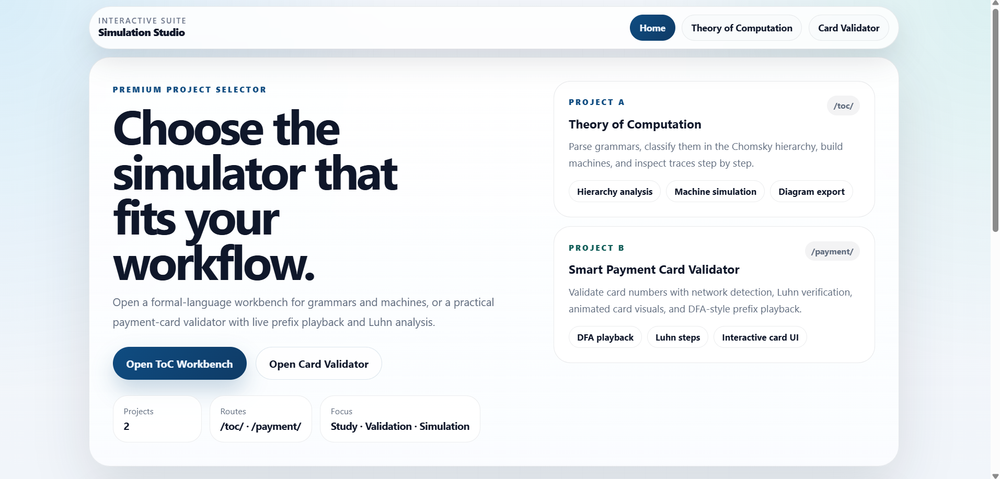
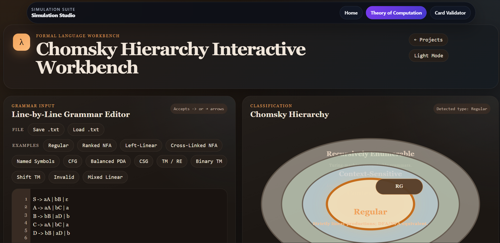
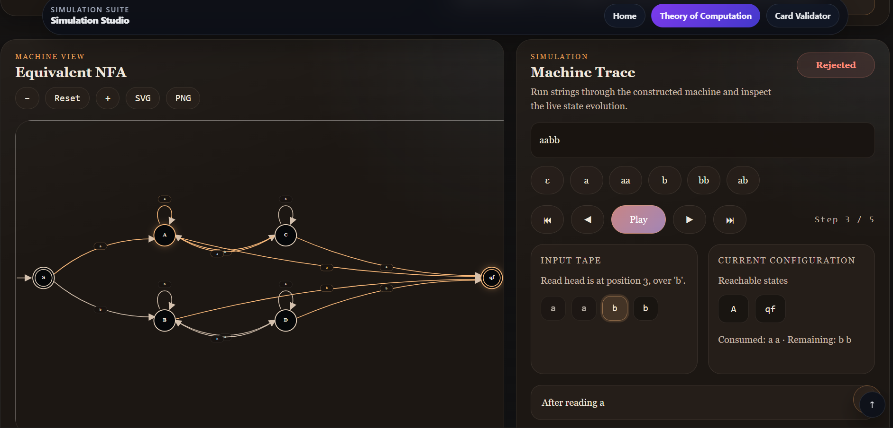
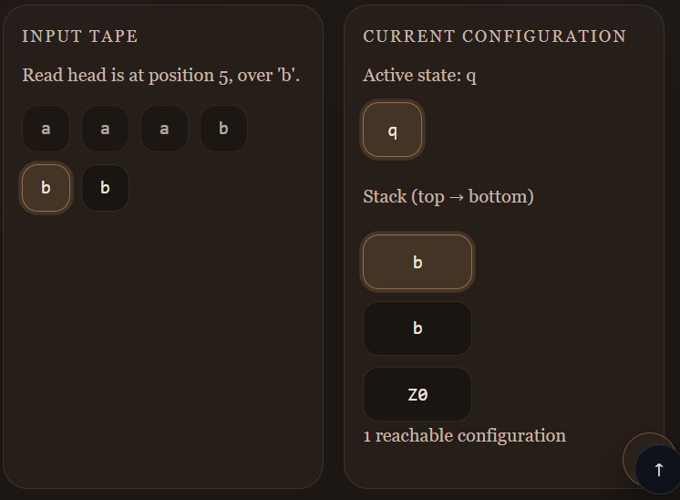
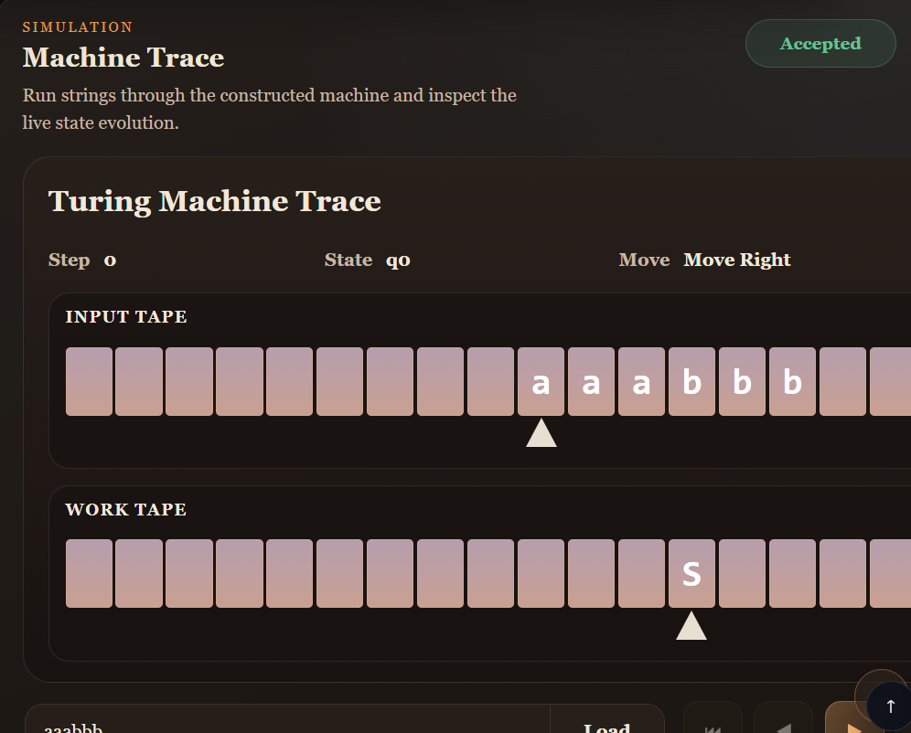
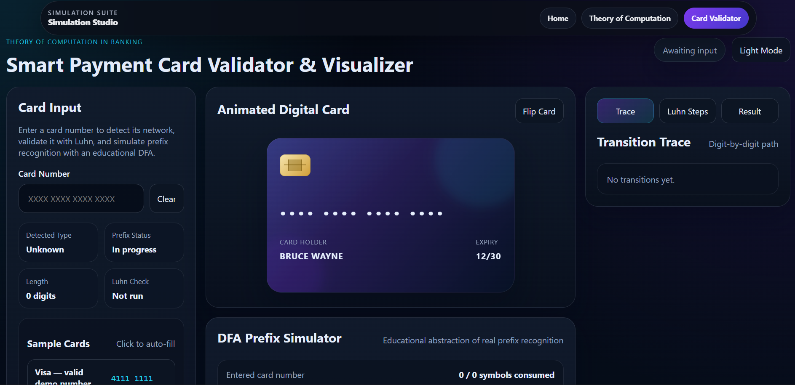
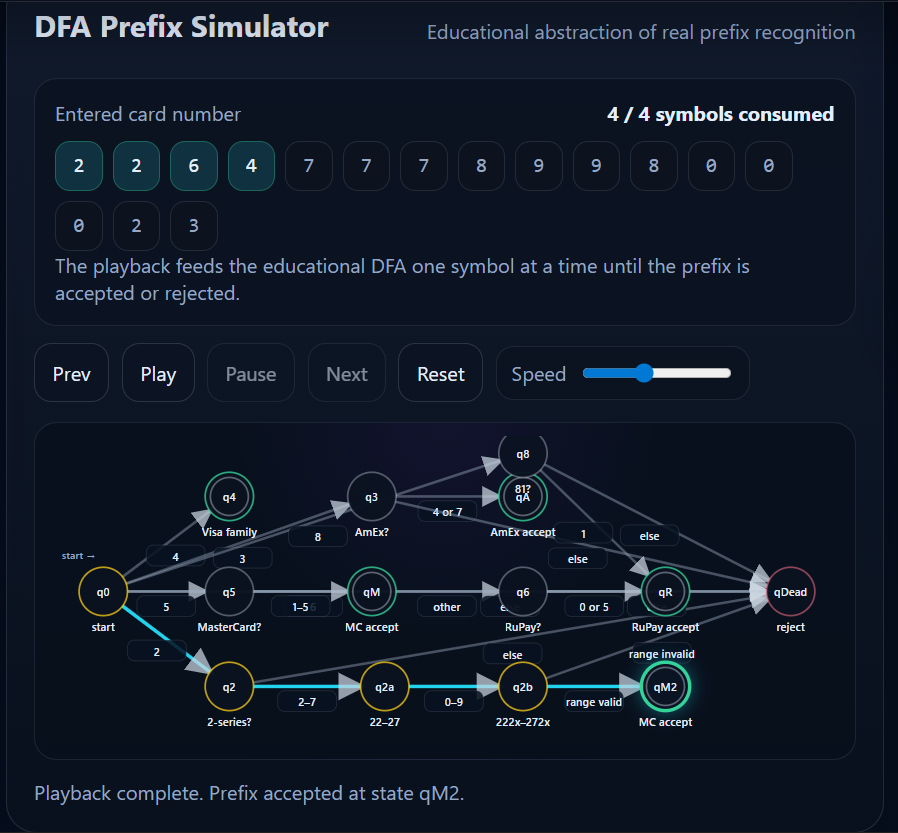
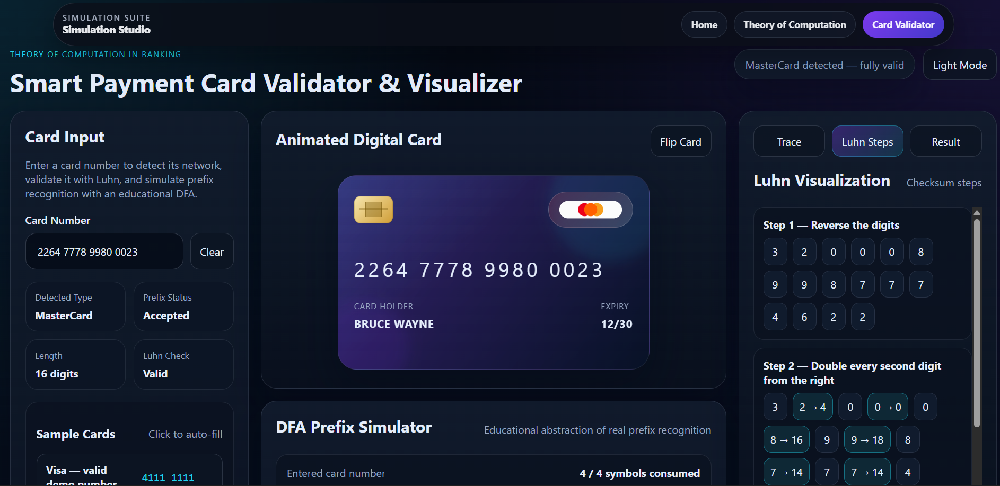

# Interactive Simulation Suite

A multi-project interactive web platform that combines two educational simulators under one website:

- **Theory of Computation Workbench**
- **Smart Payment Card Validator**

The website provides a single landing page for project selection while preserving the independent functionality and visual identity of each simulator.

---

## Live Project

[Open the Live Website](https://interactive-simulation-project.vercel.app/)

**Hosted Link:** 

`https://interactive-simulation-project.vercel.app/`

<p align="center">
  
</p>

The landing page serves as the common entry point for selecting either the Theory of Computation Workbench or the Smart Payment Card Validator.

---

## Project Overview

This project was built to provide a clean and interactive environment for exploring two technically different systems:

### 1. Theory of Computation Workbench
An educational simulator for grammars, Chomsky hierarchy classification, and machine construction/simulation.

### 2. Smart Payment Card Validator
An interactive simulator for payment card validation logic, card-number flow, and structured rule-based checking.

Both projects are integrated into one website through a shared landing page and navigation shell, while their internal logic remains independent.

---

## Main Objectives

- provide a single website for two separate simulators
- preserve the internal behavior of both projects
- make navigation between projects clean and intuitive
- present technical concepts in an interactive and visual way
- keep the platform suitable for demonstrations, study, and project review

---

# Project A: Theory of Computation Workbench

## Description

The Theory of Computation Workbench is designed to help users understand how formal grammars relate to language classes and computational models.

A user can enter a grammar, validate it, classify it in the Chomsky hierarchy, generate a corresponding machine model, and observe step-by-step simulation behavior.

<p align="center">
  
</p>

The workbench accepts grammars, validates them, classifies them into the Chomsky hierarchy, and prepares the corresponding machine model for simulation.

## Features

- line-by-line grammar editor
- grammar validation with diagnostics
- Chomsky hierarchy classification
- machine construction based on grammar type
- machine visualization
- transition relation / transition table
- machine trace / execution view
- export and save/load support
- example grammars for different classes

<p align="center">
  
</p>

The machine view and trace panels work together to show how the generated model processes the input step by step.

## Theory of Computation Concepts Demonstrated

### Formal Grammars
- production rules
- terminals and nonterminals
- epsilon productions
- grammar well-formedness
- production structure checking

### Chomsky Hierarchy
The project classifies grammars into:

- **Regular**
- **Context-Free**
- **Context-Sensitive**
- **Recursively Enumerable / Type-0**

### Automata and Machines
Based on the grammar class, the workbench maps the grammar to an appropriate machine model:

- **Regular Grammar → NFA**
- **Context-Free Grammar → PDA**
- **Context-Sensitive Grammar → LBA**
- **Type-0 / Recursively Enumerable Grammar → TM-style recognizer**

### NFA Concepts
- states and transitions
- epsilon-closure
- active-state progression
- accept/reject behavior

### PDA Concepts
- stack-based computation
- current state and stack configuration
- step-by-step stack evolution
- push / pop / match style execution

<p align="center">
  
</p>

For context-free grammars, the project demonstrates PDA behavior through explicit stack evolution, state progression, and transition-driven execution.

### LBA / Context-Sensitive Concepts
- grammar classes above CFG
- stronger machine requirements than PDA
- bounded-machine interpretation for higher grammar classes

### Turing Machine Concepts
- finite control
- tape-based view
- head position
- read / write / move behavior
- step-by-step recognizer-style execution

### Why the TM Simulation Uses Two Tapes
The Turing Machine view uses **two tapes** to make the simulation clearer and more educational:

- the **input tape** preserves the original string entered by the user
- the **work tape** acts as editable working memory for markers, intermediate symbols, and recognition steps
- this separation makes it easier to understand how the machine processes the input without losing sight of the original string
- it also reflects the idea of using extra work space in machine design to simplify recognition and step tracing

In this simulator, the two-tape presentation is mainly used to improve clarity and make the recognition process easier to follow visually.

<p align="center">
  
</p>

For Type-0 / Recursively Enumerable grammars, the workbench presents a TM-style recognizer view with tape cells, head movement, finite control, and step-by-step execution.

## Implemented ToC Functionality

- grammar parser
- grammar validator
- line-specific diagnostics
- grammar-to-machine routing
- machine construction logic
- machine trace visualization
- transition table generation
- input-driven simulation
- multiple example grammars for testing

---

# Project B: Smart Payment Card Validator

## Description

The Smart Payment Card Validator is an interactive system for demonstrating card validation logic through a more visual and structured interface than a standard form-based checker.

It focuses on how card data can be checked through rule-based validation and machine-style flow.

<p align="center">
  
</p>

The payment validator provides a structured interface for testing card-number logic, validation rules, and interactive feedback.

## Features

- card number input and validation
- structured UI feedback
- simulation-oriented interaction
- card-pattern recognition behavior
- visual validation flow

## Core Concepts Demonstrated

### Luhn Algorithm
The payment validator demonstrates the **Luhn Algorithm**, which is widely used for validating payment card numbers.

The logic includes:

- scanning digits from right to left
- doubling alternate digits
- subtracting 9 when needed
- summing processed digits
- checking divisibility of the final sum by 10

This shows how a real-world validation rule can be implemented as a deterministic sequence of steps.

<p align="center">
  
</p>

The validator combines checksum logic such as the Luhn Algorithm with structured rule-based transitions to model card validation behavior more clearly.

### Rule-Based Validation
The project also demonstrates how card validation depends on:

- length constraints
- prefix / issuer pattern checks
- structured input handling
- validation sequencing

### State-Based Thinking
Although this is not a full Theory of Computation project, it still demonstrates machine-style logic through:

- ordered validation stages
- state-like progression during checking
- deterministic transitions based on input patterns

<p align="center">
  
</p>

The result view summarizes whether the card data is valid and shows the outcome of the underlying validation stages.

---

# How the Full Website Is Built

## Overall Structure

The website is built as a merged multi-project static site with three main entry points:

- **Landing Page** → project selection
- **/toc/** → Theory of Computation Workbench
- **/payment/** → Smart Payment Card Validator

This structure keeps both projects isolated while still presenting them under one unified website.

## Integration Approach

The merge was done in a way that keeps both projects stable:

- the landing page acts as a shared entry point
- each project is placed under its own route
- shared navigation is added only at the shell level
- internal project styles and logic are preserved
- project-specific palettes are kept intact

## Front-End Design Approach

The website uses:

- clean route separation
- lightweight shared shell/navigation
- independent project sections
- minimal interference between project internals
- a professional landing page for simulator selection

---

## Project Structure

```text
/
├── index.html              # Landing page
├── toc/                    # Theory of Computation Workbench
├── payment/                # Smart Payment Card Validator
├── shared shell assets     # Navigation / shared landing styles/scripts
└── deployment config files
